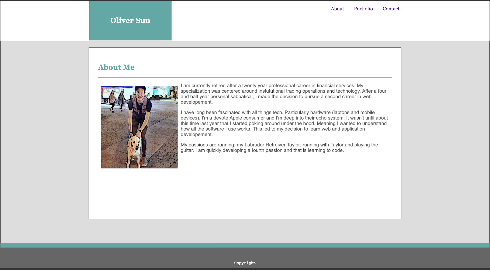
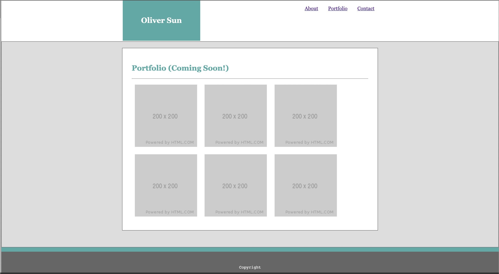
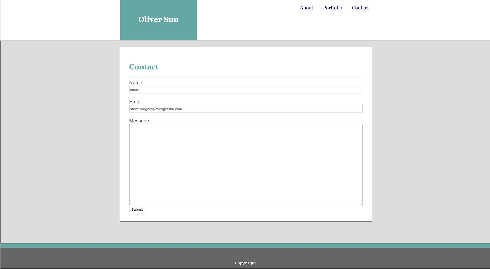
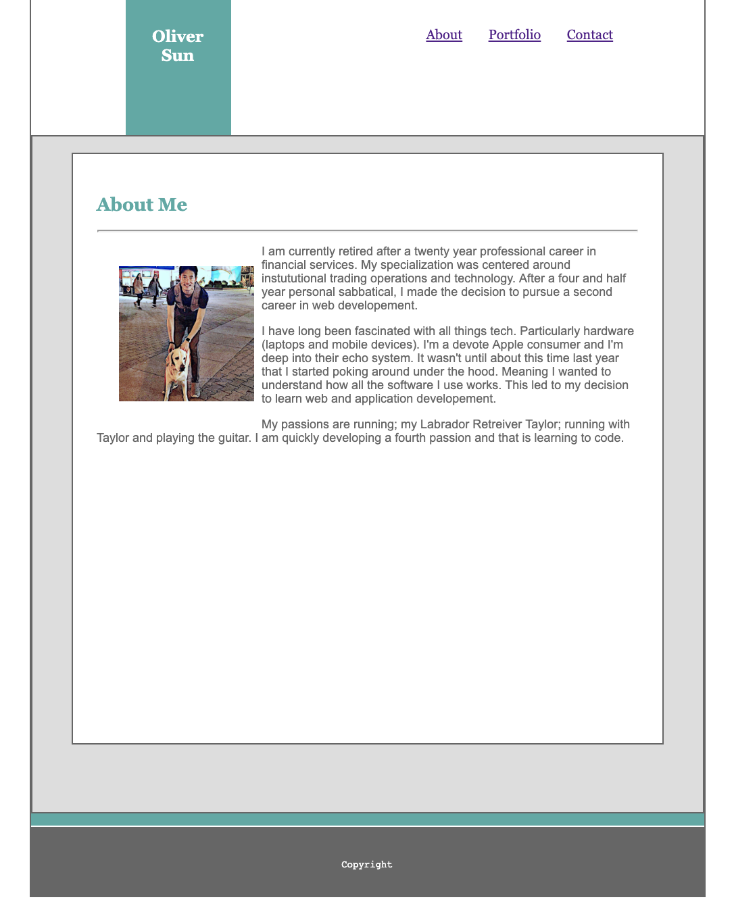
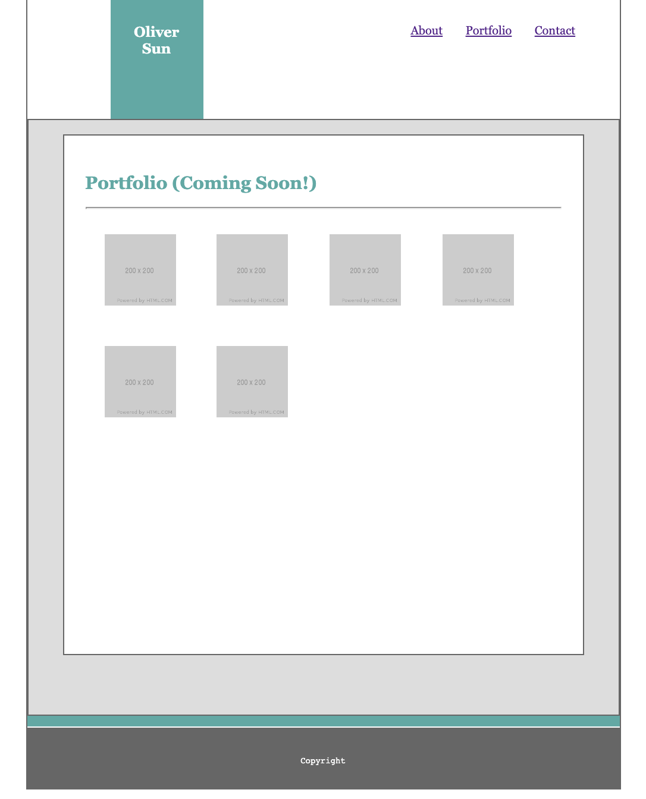
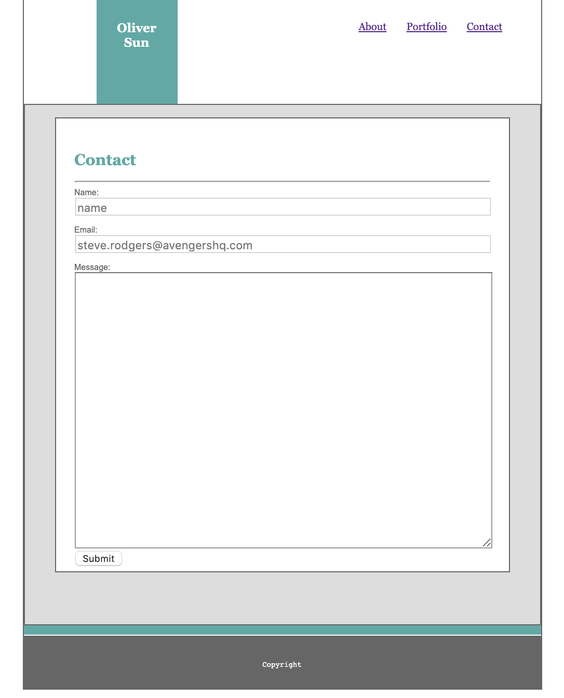

# Responsive-Portfolio

## Page previews (Full Size): 

## Page previews (Smaller Sizes): 

## About the project:
  * We had to take our Basic-Portofio project we made for our last assignment and make the pages responsive for the following screen-sizes:
    * 980px max-width
    * 768px max-width
    * 640px max-width

## Techologies used to build:
  * HTML
  * CSS
  * CSS Grid Generator Tool (from the last homework assignment but I didn't use it to add any new grids to make the pages responsive.)

## Methodology:
  I copied all my files from my Basic-Portfolio-New repo into a new repo called Responsive-Portfolio. I then added the @media screen and (max-width ...) selectors in my styles.css for each of the screen sizes (980px, 768px, 640px). I copied-pasted all of the css from the main body into each of the @media screen bodies and then proceeded go through and manually adjust the dimensions (margins, paddings, font sizes, etc....) for each. I also added a couple new html id's to target some specific divs.

  Basically, I just stretched the main content body down and made it taller. I then adjusted the margins, paddings, font-sizes, etc... to make the elements fit accordingly inside. For the 768px and 640px screen sizes, there's not much change in the css code. It seems to work for both. I will play around with the css code some more to make some finishing touches (maybe swap out the portfolio placeholders for something more exciting) if I have time before the deadline but I wanted to get this one done first.

## Acknowledgments:
  I have been playing around with CSS grid in the weeks leading up to Bootcamp. I've used this site to stucture my practive pages previously.
  * https://cssgrid-generator.netlify.com/